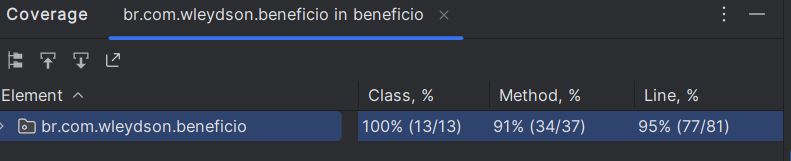

# Serviço de Benefício

## Tecnologias
- Java 17
- Spring 3.0.2
- Spring JPA
- Spring Web
- Banco H2
- Lombok

## Explicando as entidades
Foi criado um endpoint para executar as regra de negocio do benefício, existem migration 
já para popular as tabelas utilizadas e o projeto contém testes de integração.

